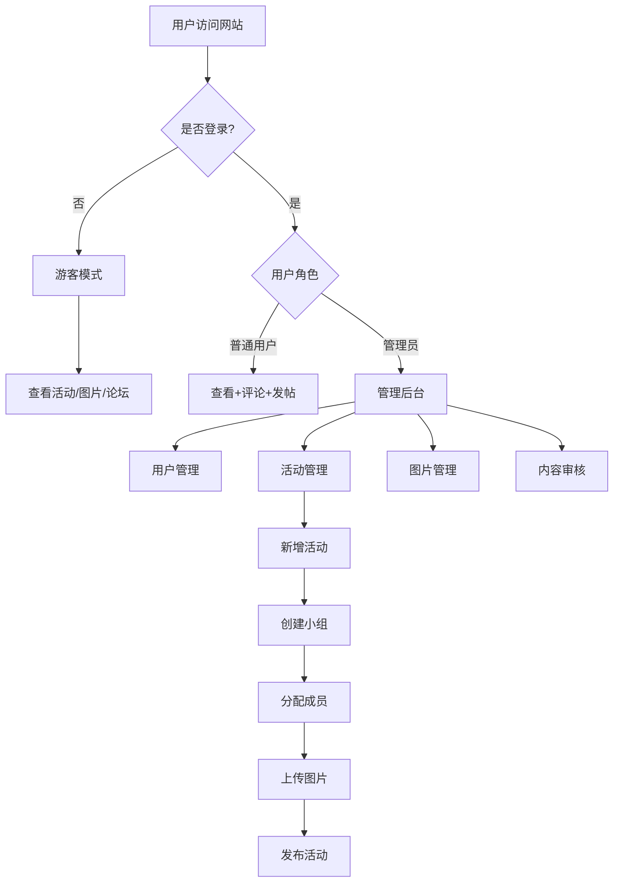

# MC服务器活动纪念网站 - 产品需求文档

## 1. 产品概述
一个用于纪念Minecraft服务器活动的网站，记录活动历程、参与玩家和精彩瞬间。支持活动管理、成员库、图片展示、论坛交流等功能，通过账号系统区分普通用户和管理员权限。

**目标用户**：Minecraft服务器管理员、活动组织者、参与玩家
**核心价值**：永久保存服务器活动记忆，促进玩家社区交流互动

## 2. 核心功能

### 2.1 用户角色

| 角色 | 注册方式 | 核心权限 |
|------|---------|---------|
| 游客 | 无需注册 | 查看活动、图片、论坛帖子 |
| 普通用户 | QQ号+账号密码注册 | 查看内容、发表评论、发布论坛帖子 |
| 管理员 | 后台设置 | 管理用户、管理活动、上传图片、管理内容 |

### 2.2 功能模块

1. **首页**：活动展示、最新动态、导航入口
2. **活动列表页**：活动卡片展示、筛选搜索
3. **活动详情页**：活动信息、小组分组、图片画廊、评论区
4. **成员库页面**：成员列表、成员详情、搜索筛选
5. **论坛页面**：帖子列表、发帖、帖子详情、评论互动
6. **个人中心**：个人信息、我的活动、我的帖子
7. **登录/注册页**：账号密码登录、QQ号注册
8. **管理后台**：用户管理、活动管理、图片管理、内容审核

### 2.3 页面详情

| 页面名称 | 模块名称 | 功能描述 |
|---------|---------|---------|
| 首页 | Hero区域 | 服务器名称、Slogan、背景动画、进入按钮 |
| 首页 | 活动展示 | 最新活动卡片、轮播展示 |
| 首页 | 快捷入口 | 进入活动列表、论坛、成员库的快捷按钮 |
| 活动列表页 | 筛选栏 | 按时间、类型筛选活动 |
| 活动列表页 | 活动卡片 | 活动封面、标题、时间、参与人数 |
| 活动详情页 | 活动信息 | 活动名称、时间、描述、参与小组 |
| 活动详情页 | 小组展示 | 小组列表、小组成员、小组得分（如有） |
| 活动详情页 | 图片画廊 | 活动照片网格展示、点击放大查看 |
| 活动详情页 | 评论区 | 用户评论、点赞、回复 |
| 成员库页面 | 成员列表 | 成员头像、昵称、QQ号、参与活动数 |
| 成员库页面 | 成员详情 | 成员信息、参与的活动历史 |
| 论坛页面 | 帖子列表 | 帖子标题、作者、时间、浏览量、评论数 |
| 论坛页面 | 发帖功能 | 标题、内容（支持Markdown）、标签 |
| 论坛页面 | 帖子详情 | 帖子内容、评论区 |
| 个人中心 | 个人信息 | 头像、昵称、QQ号、修改密码 |
| 个人中心 | 我的活动 | 参与过的活动列表 |
| 个人中心 | 我的帖子 | 发布的帖子和评论 |
| 登录/注册页 | 登录表单 | 账号、密码输入、登录按钮 |
| 登录/注册页 | 注册表单 | 昵称、QQ号、账号、密码、确认密码 |
| 管理后台 | 用户管理 | 用户列表、设置管理员、禁用用户 |
| 管理后台 | 活动管理 | 新增/编辑活动、设置小组、分配成员 |
| 管理后台 | 图片管理 | 上传图片、关联活动、删除图片 |
| 管理后台 | 内容审核 | 审核帖子、评论，删除违规内容 |

## 3. 核心流程

### 3.1 用户注册登录流程
用户访问网站 → 点击登录/注册 → 填写QQ号、账号、密码等信息 → 提交注册 → 系统验证 → 注册成功 → 使用账号密码登录 → 获得普通用户权限

### 3.2 活动浏览流程
用户访问首页 → 浏览活动卡片 → 点击进入活动详情 → 查看活动信息、小组分组、图片画廊 → 可评论互动

### 3.3 管理员创建活动流程
管理员登录 → 进入管理后台 → 点击新增活动 → 填写活动信息 → 创建小组 → 从成员库选择成员分配到小组 → 上传活动图片 → 发布活动

## 4. 用户界面设计

### 4.1 设计风格

**主题定位**：Minecraft像素风格 + 现代简约设计

**色彩方案**：
- 主色调：深绿色 (#2D5016) - 代表Minecraft草地
- 辅助色：泥土棕 (#8B4513)、石头灰 (#708090)
- 强调色：钻石蓝 (#4AEDD9)、金块黄 (#FFD700)
- 背景色：深色背景 (#1a1a2e) 配合渐变

**字体设计**：
- 标题字体：Press Start 2P（像素风格）或 VT323
- 正文字体：Noto Sans SC（中文支持良好）
- 代码/特殊文本：JetBrains Mono

**按钮风格**：
- 3D立体按钮，带有Minecraft方块质感
- 悬停时有明显的阴影和位移效果
- 点击时有按压动画

**布局风格**：
- 卡片式布局，带有像素边框
- 顶部固定导航栏
- 响应式网格系统

**图标风格**：
- 像素风格图标
- Minecraft物品图标作为装饰元素

### 4.2 页面设计概览

| 页面名称 | 模块名称 | UI元素 |
|---------|---------|--------|
| 首页 | Hero区域 | 全屏背景动画（粒子效果）、大标题像素字体、渐变遮罩、CTA按钮 |
| 首页 | 活动展示 | 横向滚动卡片、悬停放大效果、像素边框 |
| 活动列表页 | 筛选栏 | 下拉选择器、像素风格按钮 |
| 活动列表页 | 活动卡片 | 图片封面、悬停显示详情、点击进入详情页 |
| 活动详情页 | 图片画廊 | 瀑布流布局、点击放大、灯箱效果、左右切换 |
| 论坛页面 | 帖子列表 | 列表式布局、标签系统、用户头像 |
| 管理后台 | 数据表格 | 清晰的表格布局、操作按钮、分页器 |

### 4.3 响应式设计

**桌面优先设计**：
- 主要针对1920x1080及以上分辨率优化
- 次要适配1440px、1366px等常见分辨率

**移动端适配**：
- 平板：768px-1024px，调整网格列数
- 手机：375px-768px，单列布局，简化导航

**触控优化**：
- 按钮最小点击区域44x44px
- 图片画廊支持手势滑动
- 下拉刷新支持

### 4.4 动效设计

**页面过渡**：
- 路由切换时的淡入淡出效果
- 页面加载时的骨架屏动画

**交互动效**：
- 卡片悬停：轻微上浮 + 阴影加深 + 边框发光
- 按钮点击：缩放 + 颜色变化
- 图片加载：渐显效果
- 滚动：视差滚动效果
- 粒子背景：缓慢飘动的像素粒子

**特殊效果**：
- Minecraft风格的方块破碎动画（删除操作）
- 成就解锁动画（获得徽章时）
- 加载动画：Minecraft物品旋转

## 5. 数据结构设计

### 5.1 用户数据
- 用户ID
- 昵称
- QQ号
- 账号（邮箱或用户名）
- 密码（加密存储）
- 角色（普通用户/管理员）
- 头像URL
- 注册时间
- 状态（正常/禁用）

### 5.2 活动数据
- 活动ID
- 活动名称
- 活动描述
- 活动时间
- 活动类型
- 是否分组
- 创建时间
- 创建者ID

### 5.3 小组数据
- 小组ID
- 所属活动ID
- 小组名称
- 小组得分（可选）
- 小组描述

### 5.4 成员数据
- 成员ID
- 昵称
- QQ号
- 头像URL
- 备注
- 加入时间

### 5.5 小组成员关联
- 关联ID
- 小组ID
- 成员ID

### 5.6 图片数据
- 图片ID
- 所属活动ID
- 图片URL
- 图片描述
- 上传者ID
- 上传时间

### 5.7 论坛帖子数据
- 帖子ID
- 标题
- 内容
- 作者ID
- 发布时间
- 浏览量
- 标签

### 5.8 评论数据
- 评论ID
- 关联类型（活动/帖子）
- 关联ID
- 评论内容
- 评论者ID
- 评论时间

## 6. 技术约束

### 6.1 部署约束
- 使用GitHub Pages进行静态网站托管
- 使用第三方BaaS服务（如Supabase）提供后端功能
- 图片存储在GitHub仓库中

### 6.2 性能要求
- 首屏加载时间 < 3秒
- 图片懒加载
- 路由懒加载
- 合理的缓存策略

### 6.3 安全要求
- 用户密码加密存储
- JWT Token认证
- XSS防护
- CSRF防护
- 图片上传大小限制