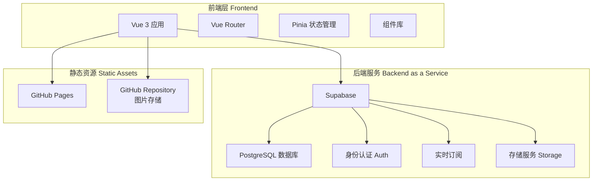

# MC服务器活动纪念网站 - 技术架构文档

## 1. 架构设计



## 2. 技术栈说明

### 2.1 前端技术
- **框架**: Vue 3 (Composition API)
- **构建工具**: Vite
- **路由**: Vue Router 4
- **状态管理**: Pinia
- **UI组件**: 自定义组件 + TailwindCSS
- **动画库**: GSAP + Motion One
- **图标**: 自定义像素图标 + Iconify
- **HTTP客户端**: Axios

### 2.2 后端服务
- **BaaS平台**: Supabase
  - PostgreSQL 数据库
  - 身份认证服务
  - 实时数据订阅
  - Row Level Security (RLS)

### 2.3 部署方案
- **前端托管**: GitHub Pages
- **图片存储**: GitHub Repository (public/assets/images/)
- **域名**: GitHub Pages 默认域名或自定义域名

### 2.4 开发工具
- **包管理器**: npm/pnpm
- **代码规范**: ESLint + Prettier
- **Git工作流**: GitHub Flow

## 3. 路由定义

| 路由路径 | 页面名称 | 权限要求 | 说明 |
|---------|---------|---------|------|
| `/` | 首页 | 游客可访问 | 展示最新活动和快捷入口 |
| `/activities` | 活动列表页 | 游客可访问 | 所有活动的列表展示 |
| `/activities/:id` | 活动详情页 | 游客可访问 | 单个活动的详细信息 |
| `/members` | 成员库页面 | 游客可访问 | 所有成员的列表 |
| `/members/:id` | 成员详情页 | 游客可访问 | 单个成员的详细信息 |
| `/forum` | 论坛页面 | 游客可访问 | 帖子列表 |
| `/forum/post/:id` | 帖子详情页 | 游客可访问 | 单个帖子的详细内容 |
| `/forum/create` | 发帖页面 | 需登录 | 创建新帖子 |
| `/login` | 登录页面 | 游客可访问 | 用户登录 |
| `/register` | 注册页面 | 游客可访问 | 用户注册 |
| `/profile` | 个人中心 | 需登录 | 个人信息管理 |
| `/admin` | 管理后台首页 | 仅管理员 | 管理后台入口 |
| `/admin/users` | 用户管理 | 仅管理员 | 管理用户 |
| `/admin/activities` | 活动管理 | 仅管理员 | 管理活动 |
| `/admin/images` | 图片管理 | 仅管理员 | 管理图片 |
| `/admin/content` | 内容审核 | 仅管理员 | 审核帖子评论 |

## 4. API定义

### 4.1 Supabase 数据库表结构

#### 用户表 (profiles - 扩展auth.users)
```sql
CREATE TABLE profiles (
  id UUID REFERENCES auth.users PRIMARY KEY,
  username VARCHAR(50) UNIQUE NOT NULL,
  qq_number VARCHAR(20) UNIQUE NOT NULL,
  nickname VARCHAR(50) NOT NULL,
  avatar_url TEXT,
  role VARCHAR(20) DEFAULT 'user' CHECK (role IN ('user', 'admin')),
  status VARCHAR(20) DEFAULT 'active' CHECK (status IN ('active', 'disabled')),
  created_at TIMESTAMP WITH TIME ZONE DEFAULT NOW(),
  updated_at TIMESTAMP WITH TIME ZONE DEFAULT NOW()
);
```

#### 活动表 (activities)
```sql
CREATE TABLE activities (
  id UUID PRIMARY KEY DEFAULT gen_random_uuid(),
  name VARCHAR(200) NOT NULL,
  description TEXT,
  activity_date DATE NOT NULL,
  activity_type VARCHAR(50),
  has_groups BOOLEAN DEFAULT false,
  cover_image TEXT,
  created_by UUID REFERENCES profiles(id),
  created_at TIMESTAMP WITH TIME ZONE DEFAULT NOW(),
  updated_at TIMESTAMP WITH TIME ZONE DEFAULT NOW()
);
```

#### 小组表 (groups)
```sql
CREATE TABLE groups (
  id UUID PRIMARY KEY DEFAULT gen_random_uuid(),
  activity_id UUID REFERENCES activities(id) ON DELETE CASCADE,
  name VARCHAR(100) NOT NULL,
  score INTEGER DEFAULT 0,
  description TEXT,
  created_at TIMESTAMP WITH TIME ZONE DEFAULT NOW()
);
```

#### 成员表 (members)
```sql
CREATE TABLE members (
  id UUID PRIMARY KEY DEFAULT gen_random_uuid(),
  nickname VARCHAR(50) NOT NULL,
  qq_number VARCHAR(20),
  avatar_url TEXT,
  notes TEXT,
  created_at TIMESTAMP WITH TIME ZONE DEFAULT NOW()
);
```

#### 小组成员关联表 (group_members)
```sql
CREATE TABLE group_members (
  id UUID PRIMARY KEY DEFAULT gen_random_uuid(),
  group_id UUID REFERENCES groups(id) ON DELETE CASCADE,
  member_id UUID REFERENCES members(id) ON DELETE CASCADE,
  joined_at TIMESTAMP WITH TIME ZONE DEFAULT NOW(),
  UNIQUE(group_id, member_id)
);
```

#### 图片表 (images)
```sql
CREATE TABLE images (
  id UUID PRIMARY KEY DEFAULT gen_random_uuid(),
  activity_id UUID REFERENCES activities(id) ON DELETE CASCADE,
  url TEXT NOT NULL,
  description TEXT,
  uploaded_by UUID REFERENCES profiles(id),
  created_at TIMESTAMP WITH TIME ZONE DEFAULT NOW()
);
```

#### 论坛帖子表 (posts)
```sql
CREATE TABLE posts (
  id UUID PRIMARY KEY DEFAULT gen_random_uuid(),
  title VARCHAR(200) NOT NULL,
  content TEXT NOT NULL,
  author_id UUID REFERENCES profiles(id),
  views INTEGER DEFAULT 0,
  tags TEXT[],
  status VARCHAR(20) DEFAULT 'published' CHECK (status IN ('published', 'hidden')),
  created_at TIMESTAMP WITH TIME ZONE DEFAULT NOW(),
  updated_at TIMESTAMP WITH TIME ZONE DEFAULT NOW()
);
```

#### 评论表 (comments)
```sql
CREATE TABLE comments (
  id UUID PRIMARY KEY DEFAULT gen_random_uuid(),
  target_type VARCHAR(20) NOT NULL CHECK (target_type IN ('activity', 'post')),
  target_id UUID NOT NULL,
  content TEXT NOT NULL,
  author_id UUID REFERENCES profiles(id),
  status VARCHAR(20) DEFAULT 'visible' CHECK (status IN ('visible', 'hidden')),
  created_at TIMESTAMP WITH TIME ZONE DEFAULT NOW()
);
```

### 4.2 Row Level Security (RLS) 策略

```sql
-- 用户表：用户只能查看和更新自己的信息
ALTER TABLE profiles ENABLE ROW LEVEL SECURITY;

CREATE POLICY "Public profiles are viewable by everyone"
  ON profiles FOR SELECT
  USING (true);

CREATE POLICY "Users can update own profile"
  ON profiles FOR UPDATE
  USING (auth.uid() = id);

-- 活动表：所有人可查看，管理员可增删改
ALTER TABLE activities ENABLE ROW LEVEL SECURITY;

CREATE POLICY "Activities are viewable by everyone"
  ON activities FOR SELECT
  USING (true);

CREATE POLICY "Admins can manage activities"
  ON activities FOR ALL
  USING (
    EXISTS (
      SELECT 1 FROM profiles
      WHERE profiles.id = auth.uid()
      AND profiles.role = 'admin'
    )
  );

-- 其他表的RLS策略类似...
```

### 4.3 前端API封装

```typescript
// src/api/supabase.ts
import { createClient } from '@supabase/supabase-js'

const supabaseUrl = import.meta.env.VITE_SUPABASE_URL
const supabaseAnonKey = import.meta.env.VITE_SUPABASE_ANON_KEY

export const supabase = createClient(supabaseUrl, supabaseAnonKey)

// src/api/auth.ts
export const authApi = {
  async register(email: string, password: string, qqNumber: string, nickname: string) {
    const { data, error } = await supabase.auth.signUp({
      email,
      password,
      options: {
        data: {
          qq_number: qqNumber,
          nickname: nickname
        }
      }
    })
    return { data, error }
  },

  async login(email: string, password: string) {
    const { data, error } = await supabase.auth.signInWithPassword({
      email,
      password
    })
    return { data, error }
  },

  async logout() {
    const { error } = await supabase.auth.signOut()
    return { error }
  },

  async getCurrentUser() {
    const { data: { user } } = await supabase.auth.getUser()
    return user
  }
}

// src/api/activities.ts
export const activitiesApi = {
  async getAll() {
    const { data, error } = await supabase
      .from('activities')
      .select('*, groups(*, group_members(*, members(*)))')
      .order('created_at', { ascending: false })
    return { data, error }
  },

  async getById(id: string) {
    const { data, error } = await supabase
      .from('activities')
      .select('*, groups(*, group_members(*, members(*))), images(*)')
      .eq('id', id)
      .single()
    return { data, error }
  },

  async create(activity: ActivityInsert) {
    const { data, error } = await supabase
      .from('activities')
      .insert(activity)
      .select()
      .single()
    return { data, error }
  }
}

// src/api/members.ts
export const membersApi = {
  async getAll() {
    const { data, error } = await supabase
      .from('members')
      .select('*')
      .order('nickname')
    return { data, error }
  },

  async create(member: MemberInsert) {
    const { data, error } = await supabase
      .from('members')
      .insert(member)
      .select()
      .single()
    return { data, error }
  }
}

// src/api/posts.ts
export const postsApi = {
  async getAll() {
    const { data, error } = await supabase
      .from('posts')
      .select('*, profiles(nickname, avatar_url)')
      .eq('status', 'published')
      .order('created_at', { ascending: false })
    return { data, error }
  },

  async create(post: PostInsert) {
    const { data, error } = await supabase
      .from('posts')
      .insert(post)
      .select()
      .single()
    return { data, error }
  }
}
```

## 5. 项目目录结构

```
dsf_web/
├── .github/
│   └── workflows/
│       └── deploy.yml          # GitHub Actions部署配置
├── public/
│   └── assets/
│       └── images/             # 图片存储目录
│           ├── activities/     # 活动图片
│           ├── avatars/        # 用户头像
│           └── misc/           # 其他图片
├── src/
│   ├── api/                    # API接口封装
│   │   ├── supabase.ts
│   │   ├── auth.ts
│   │   ├── activities.ts
│   │   ├── members.ts
│   │   ├── posts.ts
│   │   └── comments.ts
│   ├── assets/                 # 静态资源
│   │   ├── fonts/              # 字体文件
│   │   ├── images/             # 图片资源
│   │   └── styles/             # 全局样式
│   ├── components/             # 组件
│   │   ├── common/             # 通用组件
│   │   │   ├── PixelButton.vue
│   │   │   ├── PixelCard.vue
│   │   │   ├── LoadingSpinner.vue
│   │   │   └── Modal.vue
│   │   ├── layout/             # 布局组件
│   │   │   ├── Navbar.vue
│   │   │   ├── Footer.vue
│   │   │   └── Sidebar.vue
│   │   ├── activity/           # 活动相关组件
│   │   │   ├── ActivityCard.vue
│   │   │   ├── ActivityGallery.vue
│   │   │   └── GroupDisplay.vue
│   │   ├── member/             # 成员相关组件
│   │   │   ├── MemberCard.vue
│   │   │   └── MemberList.vue
│   │   ├── forum/              # 论坛相关组件
│   │   │   ├── PostCard.vue
│   │   │   ├── PostEditor.vue
│   │   │   └── CommentSection.vue
│   │   └── admin/              # 管理后台组件
│   │       ├── UserTable.vue
│   │       ├── ActivityForm.vue
│   │       └── ImageUploader.vue
│   ├── composables/            # 组合式函数
│   │   ├── useAuth.ts
│   │   ├── useActivities.ts
│   │   └── useMembers.ts
│   ├── router/                 # 路由配置
│   │   └── index.ts
│   ├── stores/                 # Pinia状态管理
│   │   ├── auth.ts
│   │   ├── activities.ts
│   │   └── members.ts
│   ├── types/                  # TypeScript类型定义
│   │   ├── database.ts
│   │   ├── activity.ts
│   │   ├── member.ts
│   │   └── post.ts
│   ├── utils/                  # 工具函数
│   │   ├── format.ts
│   │   ├── validation.ts
│   │   └── storage.ts
│   ├── views/                  # 页面组件
│   │   ├── Home.vue
│   │   ├── Activities.vue
│   │   ├── ActivityDetail.vue
│   │   ├── Members.vue
│   │   ├── MemberDetail.vue
│   │   ├── Forum.vue
│   │   ├── PostDetail.vue
│   │   ├── CreatePost.vue
│   │   ├── Login.vue
│   │   ├── Register.vue
│   │   ├── Profile.vue
│   │   └── admin/
│   │       ├── Dashboard.vue
│   │       ├── UserManagement.vue
│   │       ├── ActivityManagement.vue
│   │       ├── ImageManagement.vue
│   │       └── ContentReview.vue
│   ├── App.vue
│   └── main.ts
├── .env.example                # 环境变量示例
├── .eslintrc.js               # ESLint配置
├── .prettierrc                # Prettier配置
├── index.html
├── package.json
├── postcss.config.js
├── tailwind.config.js
├── tsconfig.json
└── vite.config.ts
```

## 6. 开发流程

### 6.1 环境准备
1. 安装Node.js (v18+)
2. 安装pnpm: `npm install -g pnpm`
3. 克隆项目: `git clone <repository-url>`
4. 安装依赖: `pnpm install`
5. 配置环境变量: 复制`.env.example`为`.env`并填写Supabase配置

### 6.2 Supabase配置
1. 创建Supabase项目
2. 执行数据库迁移脚本创建表结构
3. 配置RLS策略
4. 获取项目URL和Anon Key
5. 在`.env`文件中配置:
   ```
   VITE_SUPABASE_URL=your_supabase_url
   VITE_SUPABASE_ANON_KEY=your_supabase_anon_key
   ```

### 6.3 本地开发
```bash
# 启动开发服务器
pnpm dev

# 构建生产版本
pnpm build

# 预览生产构建
pnpm preview

# 代码检查
pnpm lint
```

### 6.4 部署流程
1. 推送代码到GitHub主分支
2. GitHub Actions自动构建并部署到GitHub Pages
3. 图片通过Git LFS或直接提交到仓库

## 7. 性能优化策略

### 7.1 代码分割
- 路由懒加载
- 组件按需加载
- 第三方库按需引入

### 7.2 图片优化
- 使用WebP格式
- 图片懒加载
- 响应式图片
- 缩略图预览

### 7.3 缓存策略
- 静态资源CDN缓存
- Service Worker缓存
- LocalStorage缓存用户数据

### 7.4 数据库优化
- 合理的索引设计
- 分页查询
- 数据预加载

## 8. 安全措施

### 8.1 认证安全
- JWT Token认证
- Token自动刷新
- 安全的密码存储（Supabase内置）

### 8.2 数据安全
- Row Level Security
- 输入验证
- XSS防护
- CSRF防护

### 8.3 文件上传安全
- 文件类型验证
- 文件大小限制
- 图片压缩处理

## 9. 扩展性考虑

### 9.1 未来功能扩展
- 活动报名系统
- 成就徽章系统
- 实时聊天功能
- 数据统计可视化

### 9.2 技术扩展
- 支持更多第三方登录
- PWA支持
- 国际化支持